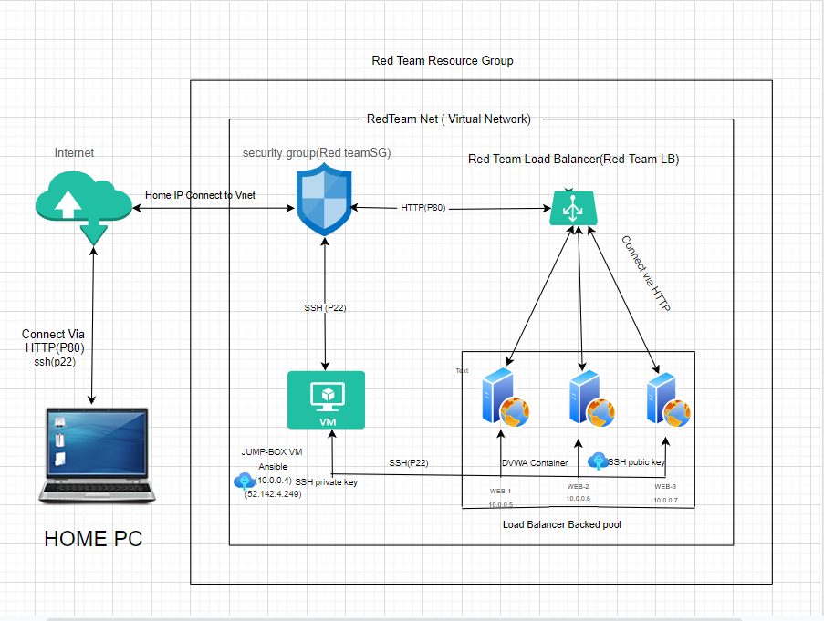
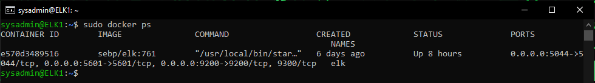

## Automated ELK Stack Deployment

The files in this repository were used to configure the network depicted below.

These files have been tested and used to generate a live ELK deployment on Azure. They can be used to either recreate the entire deployment pictured above. Alternatively, select portions of the YAML file may be used to install only certain pieces of it, such as Filebeat.

  - [Elk installation]( https://github.com/Nikkighadimi/ELK--project/blob/main/ansible/install-Elk.yml.txt#L1)
  
  - [Filebeat/Metricbeat installation]( https://github.com/Nikkighadimi/ELK--project/blob/main/ansible/Filebeat-Metricbeat.yml.txt )

This document contains the following details:
- Description of the Topologies
- Access Policies
- ELK Configuration
  - Beats in Use
  - Machines Being Monitored
- How to Use the Ansible Build

### Description of the Topology

The main purpose of this network is to expose a load-balanced and monitored instance of DVWA, the D*mn Vulnerable Web Application.

Load balancing ensures that the application will be highly available, in addition to restricting access to the network.

Load balancer are protecting the availability of data by distributing traffic between servers. The jump-box allows easy configuration of other computers on the network. 

Integrating an ELK server allows users to easily monitor the vulnerable VMs for changes to the logs and system metrics.
- Filebeat watches for logs and sends them to Elasticsearch.
- Metricbeat collects system metrics and sends them to Elasticsearch.

The configuration details of each machine may be found below.

| Name     | Function | IP Address | Operating System     |
|----------|----------|------------|----------------------|
| Jump Box | Gateway  | 10.0.0.1   | Linux (Ubuntu 18.04) |
| Web-1    | Server   | 10.0.0.5   | Linux (Ubuntu 18.04) |
| Web-2    | Server   | 10.0.0.6   | Linux (Ubuntu 18.04) |
| Elk      | Server   | 10.1.0.4   | Linux (Ubuntu 18.04) |

### Access Policies

The machines on the internal network are not exposed to the public Internet. 

Only the jump-box machine can accept connections from the Internet. Access to this machine is only allowed from the following IP addresses:
- My personal IP address

Machines within the network can only be accessed by Jump-box.
- The jump-box machine was the VM used to access the Elk server at IP:10.1.0.4

A summary of the access policies in place can be found in the table below.

| Name     | Publicly Accessible | Allowed IP Addresses |
|----------|---------------------|----------------------|
| Jump Box | Yes                 |My personal IP address|
| WEB-1    | NO                  |  10.0.0.1            |
| WEB-2    | NO                  |  10.0.0.1            |
| Elk      | NO                  |  10.0.0.1            |

### Elk Configuration

Ansible was used to automate configuration of the ELK machine. No configuration was performed manually, which is advantageous because...
- Ansible helps any user to reduce error by configuring automatically, Ansible also helps to configure the adding of larger number of Docker containers. It is a huge time saver because of these reasons.

The playbook implements the following tasks:
* The first task is installing docker.io 
* The second task was to install python pip3
* The third task was to Install Docker python module
* The fourth task was increasing the system memory to allows Elk container to Run
* The fifth task was to download the Elk docker container
* The last task was Enable service docker on boot

The following screenshot displays the result of running `docker ps` after successfully configuring the ELK instance.

### Target Machines & Beats
This ELK server is configured to monitor the following machines:
- WEB-1 [10.0.0.5]
- WEB-2 [10.0.0.6]

We have installed the following Beats on these machines:
- Filebeat and Metricbeat

These Beats allow us to collect the following information from each machine:
 
- Filebeat watches for logs and sends them to Elasticsearch.

- Metricbeat collects system metrics and sends them to Elasticsearch.

### Using the Playbook
In order to use the playbook, you will need to have an Ansible control node already configured. Assuming you have such a control node provisioned: 

SSH into the control node and follow the steps below:
- Copy the Yaml file to /etc/ansible/.
- Update the hosts file to include the Ip addresses of the web servers and the Elk machine

- Run the playbook and navigate to the Elk VM to check that the installation worked as expected.

- the name of the play book is install-Elk.yml and you copy it on an /etc/ansible/
- The host file is the file you update to tell the play books which machines to install the containers on.
- The Url that you go to in order to check Kibana is running is HTTP://YOUR.VM.PUBLIC.IP:5601/APP/Kibana 

_As a **Bonus**, provide the specific commands the user will need to run to download the playbook, update the files, etc._
